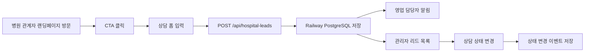

# 병원 영업용 랜딩페이지 제작 계획안

작성일: 2026-05-01  
대상 서비스: 창조트리문화센터  
목적: 산부인과, 산후조리원, 소아과, 여성병원 대상 B2B 도입 상담 전환용 랜딩페이지 제작 기준 수립

---

## 1. 최종 방향 요약

이번 랜딩페이지의 핵심은 창조트리문화센터를 단순한 이벤트, 클래스, 선물 프로모션으로 보이게 하지 않는 것이다. 병원 의사결정자가 보기에는 다음 한 문장으로 이해되어야 한다.

> 창조트리문화센터는 산모에게는 1년짜리 문화혜택을, 병원에는 다시 기억되는 고객 접점을 만들어주는 병원 전용 AI 문화센터입니다.

따라서 페이지는 "산모가 좋아할 혜택"보다 "병원이 도입해야 하는 이유"를 먼저 설득해야 한다. 산모 입장에서는 선물, AI 이미지, 문화센터가 매력 포인트지만, 병원장과 마케팅 담당자 입장에서는 차별화, 고객 관계, 운영 부담 감소, 의료광고 리스크 관리, 참여 리포트가 더 중요한 판단 기준이다.

### 핵심 포지셔닝

| 항목 | 방향 |
| --- | --- |
| 서비스 정의 | 병원 전용 AI 문화센터 |
| 고객 가치 | 산모가 병원을 오래 기억하게 만드는 1년형 문화혜택 |
| 병원 가치 | 진료 이후의 고객 접점, 브랜드 경험, 자연스러운 재접촉 구조 |
| 운영 방식 | 앱 기반 AI 이미지 서비스 + 오프라인 클래스 + 선물 미션 + 참여 리포트 |
| 표현 톤 | 프리미엄 B2B, 신뢰감, 따뜻한 산모 감성, 과장 없는 AI 혁신감 |

---

## 2. 이 랜딩페이지가 해결해야 할 질문

병원 의사결정자는 페이지를 보며 다음 질문을 한다.

1. 우리 병원에 왜 지금 이런 서비스가 필요한가?
2. 산모가 실제로 좋아할 만한가?
3. 병원 브랜드와 고객 관리에 어떤 도움이 되는가?
4. 직원이 운영하느라 힘들어지지는 않는가?
5. 의료광고, 후기 보상, 금품 제공 같은 리스크는 없는가?
6. 도입하면 산모에게 어떻게 안내되는가?
7. 비용과 구성은 병원 규모에 맞게 조정 가능한가?
8. 상담 신청을 하면 어떤 제안을 받을 수 있는가?

랜딩페이지는 이 질문에 순서대로 답해야 한다.

---

## 3. 제작 목표와 KPI

### 3.1 1차 목표

- 병원 관계자의 도입 상담 신청
- 병원 전용 제안서 요청
- 서비스 화면 또는 데모 확인 클릭
- 전화, 카카오 상담, 이메일 문의 유도

### 3.2 2차 목표

- 창조트리문화센터를 "광고 상품"이 아니라 "고객 경험 인프라"로 인식시키기
- 산모 대상 B2C 혜택을 병원 B2B 언어로 재해석하기
- 도입 리스크를 낮게 느끼게 하기
- 실제 상담 시 패키지 제안으로 이어질 근거 만들기

### 3.3 추적 이벤트

| 이벤트명 | 발생 위치 | 목적 |
| --- | --- | --- |
| `click_hero_consult` | Hero CTA | 첫 화면 상담 의도 측정 |
| `click_demo_view` | Hero, Solution | 서비스 화면 관심도 측정 |
| `scroll_solution` | Solution 도달 | 핵심 서비스 이해 구간 도달률 |
| `scroll_journey` | 고객 여정 도달 | 1년형 접점 설득 구간 도달률 |
| `click_package_consult` | 패키지 카드 | 구성별 관심도 측정 |
| `click_kakao_consult` | Sticky CTA, Footer | 즉시 상담 전환 |
| `click_phone` | Sticky CTA, Footer | 전화 상담 전환 |
| `start_lead_form` | 상담 폼 입력 시작 | 폼 진입률 측정 |
| `submit_lead_form` | 상담 폼 제출 | 최종 전환 |

---

## 4. 최신 시장 근거와 표현 기준

### 4.1 저출생 시장 근거

2026년 2월 25일 통계청이 발표한 2025년 출생·사망통계 잠정 결과 기준으로, 2025년 출생아 수는 25만 4,500명, 합계출산율은 0.80명으로 발표되었다. 이 수치는 전년 대비 반등 신호가 있으나, 병원 입장에서는 여전히 산모 고객 한 명의 경험 가치와 장기 관계 관리가 중요한 시장임을 보여준다.

출처: [대한민국 정책브리핑, 2025년 출생·사망통계 잠정](https://www.korea.kr/briefing/policyBriefingView.do?newsId=156745912&pWise=main&pWiseMain=L1)

### 4.2 의료광고 및 후기 보상 표현 기준

병원 영업용 랜딩페이지에서는 "진료 후기 작성 시 상품권 지급", "병원 추천글 작성 시 선물 지급", "출산 후기 작성 시 리워드" 같은 표현을 쓰지 않는다. 의료기관 마케팅에서는 금품 제공을 통한 환자 유인, 치료경험담 광고, 대가성 후기 게시물 등이 쟁점이 될 수 있다.

관련 근거:

- [국가법령정보센터 의료법 제27조](https://www.law.go.kr/lsInfoP.do?lsiSeq=272583&efYd=20250423#0000)
- [국가법령정보센터 의료법 제56조](https://www.law.go.kr/lsInfoP.do?lsiSeq=272583&efYd=20250423#0000)
- [보건복지부, 치료경험담 등 불법의료광고 적발 보도자료](https://www.mohw.go.kr/board.es?act=view&bid=0027&list_no=371102&mid=a10503010100)

### 4.3 랜딩페이지에서 사용할 안전한 표현

사용 권장:

- 문화센터 프로그램 만족도 조사
- 작품 후기
- 클래스 참여 인증
- 비의료 영역 중심의 참여 반응
- 미션 완료 혜택
- 문화센터 운영 혜택
- 출산 준비 선물 구성
- 병원별 운영 가이드 제공

사용 금지:

- 병원 후기 작성 시 상품권 지급
- 진료 후기 작성 시 선물 증정
- 치료 경험담 작성 리워드
- 병원 추천글 작성 보상
- 출산 후기 작성 시 백화점상품권 지급

상담 단계 안내 문구:

> 진료 후기나 치료경험담을 조건으로 한 보상은 의료광고 규정상 주의가 필요합니다. 창조트리문화센터는 문화센터 프로그램 만족도, 작품 후기, 참여 인증 등 비의료 영역 중심으로 운영 가이드를 제안합니다.

---

## 5. 핵심 카피 전략

### 5.1 메인 카피 1순위

> 산모가 병원을 선택한 이유를, 출산 후에도 계속 기억하게 합니다.

이 문구는 병원장 관점에서 가장 설득력이 좋다. "산모가 좋아한다"가 아니라 "병원이 기억된다"는 결과를 직접 말하기 때문이다.

### 5.2 메인 카피 2순위

> 우리 병원의 산모 고객에게 1년 내내 기억되는 문화혜택을 선물하세요.

감성적이고 직관적이다. 단, "선물하세요"가 다소 B2C스럽게 느껴질 수 있으므로 첫 화면의 큰 헤드라인보다는 보조 헤드라인 또는 마지막 CTA에 적합하다.

### 5.3 최종 추천 Hero 문구

상단 라벨:

> 전국 산부인과 · 산후조리원 · 소아과 전용

메인 헤드라인:

> 산모가 병원을 선택한 이유를,  
> 출산 후에도 계속 기억하게 합니다.

서브 카피:

> 창조트리문화센터는 AI 이미지 생성, 오프라인 문화센터, 참여 선물, 미션 리워드를 하나로 연결한 병원 전용 임산부 문화서비스입니다. 산모는 임신부터 출산 후까지 즐기고, 병원은 반복되는 고객 접점과 차별화된 브랜드 경험을 얻습니다.

CTA:

- 도입 상담 신청하기
- 서비스 화면 보기

신뢰 보조 문구:

> AI 이미지 1년 이용권 · 오프라인 문화센터 운영 · 선물 미션 시스템 · 병원별 맞춤 리포트

### 5.4 페이지 전체를 관통하는 문구

> 진료는 병원의 기본입니다. 이제는 산모가 병원을 기억하게 만드는 경험이 필요합니다.

> 광고보다 오래 남는 것은, 산모가 직접 경험한 혜택입니다.

> 산모에게는 추억을 만드는 시간, 병원에는 다시 기억되는 이유를 만듭니다.

> 출산 전후의 모든 순간에 병원의 이름이 자연스럽게 함께합니다.

> 산모가 병원을 떠난 뒤에도, 병원의 혜택은 계속 남습니다.

> 병원을 선택한 고객이, 병원을 추천하는 고객이 되도록 돕습니다.

---

## 6. 권장 페이지 구조

최종 랜딩페이지는 10개 섹션으로 압축하는 것이 좋다. 기존 초안처럼 14개 이상으로 길게 구성하면 정보는 풍부하지만 전환 흐름이 느려질 수 있다. 대신 각 섹션 안에서 필요한 내용을 밀도 있게 보여준다.

1. Hero: 병원 전용 AI 문화센터
2. Why Now: 저출생 시대, 진료 이후 경험 경쟁
3. Solution: AI 이미지 + 문화센터 + 선물 미션
4. Hospital Benefits: 병원이 얻는 6가지 효과
5. Journey: 임신부터 출산 후까지 1년 고객 접점
6. Differentiation: 기존 문화센터와 차이
7. Operation: 병원 부담을 줄이는 도입 방식
8. Packages: 도입 규모별 3가지 구성
9. B2C Preview: 산모에게 보이는 안내 예시
10. FAQ + Lead Form: 불안 해소와 상담 전환

Sticky CTA는 전 구간에 유지한다.

---

## 7. 섹션별 상세 제작 가이드

## Section 01. Hero

### 목적

첫 화면에서 "무슨 서비스인지", "누구를 위한 것인지", "병원이 왜 봐야 하는지"를 5초 안에 이해시킨다.

### 추천 문구

라벨:

> 전국 산부인과 · 산후조리원 · 소아과 전용

헤드라인:

> 산모가 병원을 선택한 이유를,  
> 출산 후에도 계속 기억하게 합니다.

본문:

> 창조트리문화센터는 AI 이미지 생성, 오프라인 문화센터, 참여 선물, 미션 리워드를 하나로 연결한 병원 전용 임산부 문화서비스입니다. 산모는 임신부터 출산 후까지 즐기고, 병원은 반복되는 고객 접점과 차별화된 브랜드 경험을 얻습니다.

CTA:

- 도입 상담 신청하기
- 서비스 화면 보기

하단 신뢰 문구:

> AI 이미지 1년 이용권 · 오프라인 문화센터 운영 · 선물 미션 시스템 · 병원별 맞춤 리포트

### 디자인

- 배경은 딥 네이비 또는 다크 그라데이션을 사용한다.
- 보라색 AI 글로우는 사용하되, 화면 전체가 보라색으로만 보이지 않게 민트, 핑크, 웜 화이트를 함께 사용한다.
- 왼쪽은 텍스트와 CTA, 오른쪽은 스마트폰 목업 3개를 겹쳐 배치한다.
- 스마트폰 목업에는 다음 화면을 노출한다.
  - AI 이미지 생성 화면
  - 문화센터 클래스 목록
  - 미션/선물 진행률 화면
  - 병원 전용 혜택 안내 화면
- 오른쪽 아래에는 작은 플로팅 카드 3개를 배치한다.
  - "AI 이미지 1년 이용권"
  - "오프라인 클래스"
  - "선물 미션"

### 모바일

- 헤드라인은 2-3줄 이내로 유지한다.
- 스마트폰 목업은 한 장을 크게 보여주고, 나머지는 뒤에 살짝 겹쳐 깊이만 준다.
- CTA는 2개를 세로 배치한다.

---

## Section 02. Why Now

### 목적

병원장이 "이걸 지금 해야 하는 이유"를 이해하게 한다.

### 섹션 제목

> 저출생 시대, 병원의 경쟁은 진료 이후의 경험에서 갈립니다.

### 본문

> 산모 고객은 줄어들고, 병원 간 시설과 진료 서비스의 차별화는 점점 어려워지고 있습니다. 이제 산부인과와 산후조리원은 단순히 진료와 시설만으로 기억되는 것이 아니라, 임신 기간 동안 어떤 경험을 제공했는가로 선택되고 추천됩니다.

### 카드 3개

1. 산모 고객 감소

> 한 명의 산모 고객 경험 가치가 더 커졌습니다.

2. 단발성 이벤트의 한계

> 일회성 선물이나 행사만으로는 병원 브랜드가 오래 남기 어렵습니다.

3. 안전한 고객 경험 콘텐츠 필요

> 의료광고보다 자연스럽고 안전한 비의료 영역의 경험 콘텐츠가 필요합니다.

### 디자인

- 배경은 밝은 웜 화이트 계열로 전환한다.
- 숫자 카드, 짧은 문제 카드, 작은 아이콘을 사용한다.
- 통계 숫자는 과하게 크게 쓰지 않고 신뢰 보조 정보로 배치한다.

---

## Section 03. Solution

### 목적

창조트리문화센터의 구성 요소를 명확하게 보여준다.

### 섹션 제목

> 창조트리문화센터는 병원이 제공하는 산모 전용 AI 문화혜택입니다.

### 본문

> 온라인 AI 이미지 서비스와 오프라인 문화센터, 선물 미션을 하나로 연결해 산모가 임신부터 출산 후까지 계속 이용할 수 있는 병원 전용 혜택 구조를 만듭니다.

### 3대 서비스 카드

1. AI 이미지 생성 서비스

제목:

> 임신 기간 내내 즐기는 AI 이미지 1년 이용권

본문:

> 만삭사진, 가족사진, 아기 스냅사진, 스티커, 사진 스타일 변경 등 산모가 직접 추억을 만들 수 있는 AI 이미지 서비스를 제공합니다.

감성 보조:

> 초음파 사진에서 시작해 만삭, 출산, 가족사진까지 산모의 모든 순간을 작품으로 남깁니다.

2. 오프라인 문화센터 운영

제목:

> 산모가 직접 참여하는 병원 전용 문화 프로그램

본문:

> 기저귀케이크 만들기, 캔들 만들기, 초음파앨범 만들기, 태교 소품 만들기 등 임산부 고객의 니즈에 맞춘 오프라인 프로그램을 운영합니다.

감성 보조:

> 병원에서 만나는 문화센터, 산모에게는 휴식이 되고 병원에는 브랜드 경험이 됩니다.

3. 선물 미션 시스템

제목:

> 참여할수록 혜택이 쌓이는 미션형 리워드 구조

본문:

> 프로그램 참여, 작품 완성, 미션 달성에 따라 출산 준비 선물과 문화센터 혜택을 제공합니다.

감성 보조:

> 문화센터를 즐기면 혜택이 쌓이고, 병원에 대한 좋은 기억도 함께 쌓입니다.

### 디자인

- 3개 카드는 같은 크기로 맞춘다.
- 카드 안에는 스크린샷, 클래스 사진, 선물 이미지 중 하나를 반드시 넣는다.
- 서비스가 추상적으로 보이지 않게 실제 앱 UI와 오프라인 장면을 함께 사용한다.

---

## Section 04. Hospital Benefits

### 목적

산모 혜택을 병원 성과 언어로 변환한다.

### 섹션 제목

> 병원은 고객 경험을 만들고, 산모는 병원을 오래 기억합니다.

### 효과 카드 6개

1. 병원 차별화

> 같은 진료, 비슷한 시설 경쟁에서 벗어나 우리 병원만의 문화혜택을 만들 수 있습니다.

2. 산모 고객 락인

> 임신 초기부터 출산 후까지 산모가 병원 혜택을 반복적으로 경험합니다.

3. 자연스러운 입소문

> 산모가 직접 만든 AI 이미지와 문화센터 작품은 가족, 지인, 지역 커뮤니티로 자연스럽게 확산될 수 있습니다.

4. 운영 부담 감소

> 앱 안내, 프로그램 기획, 클래스 구성, 선물 미션, 참여 관리를 창조트리문화센터가 함께 설계합니다.

5. 조리원·소아과 연계

> 출산 이후에도 산후조리원, 소아과, 가족사진, 돌잔치 콘텐츠로 고객 관계를 이어갈 수 있습니다.

6. 브랜드 경험 강화

> 산모가 "이 병원에 다니기 때문에 받을 수 있는 혜택"으로 인식하게 만듭니다.

### 디자인

- 화이트 카드 6개를 3열 또는 2열 그리드로 배치한다.
- 각 카드에는 병원장 관점의 짧은 제목과 한 줄 설명을 넣는다.
- 너무 감성적인 일러스트보다 간결한 라인 아이콘을 사용한다.

---

## Section 05. Journey

### 목적

이 서비스가 단발성 이벤트가 아니라 1년형 고객 접점이라는 점을 설득한다.

### 섹션 제목

> 임신부터 출산 후까지, 산모의 모든 순간에 병원이 함께합니다.

### 타임라인

1. 임신 초기

> 초음파 사진 등록  
> AI 아기 얼굴 생성  
> 임신 축하 웰컴 혜택 제공

2. 임신 중기

> 태교 문화센터 참여  
> 캔들, 태교 소품, 초음파앨범 클래스  
> 참여 선물 지급

3. 만삭 시기

> AI 만삭사진 생성  
> 가족사진 스타일 변경  
> 만삭 기념 작품 제작

4. 출산 전후

> 출산 준비 선물 미션  
> 기저귀케이크, 아기 손수건, 물티슈 등 실용 선물 제공

5. 출산 후

> 가족사진, 아기 스냅사진, 성장 스티커 생성  
> 소아과·산후조리원 연계 프로그램 운영

### 하단 강조 문구

> 단 한 번의 이벤트가 아니라, 산모가 병원을 기억하는 1년의 경험을 설계합니다.

### 디자인

- 데스크톱은 가로 타임라인 또는 S자형 흐름으로 구성한다.
- 모바일은 세로 타임라인이 적합하다.
- 각 단계마다 작은 앱 화면 또는 이미지 썸네일을 연결한다.
- "병원 접점"과 "산모 경험"을 구분해 보여주면 더 설득력 있다.

예시 구조:

| 단계 | 산모 경험 | 병원 접점 |
| --- | --- | --- |
| 임신 초기 | AI 이미지 시작 | 웰컴 혜택 안내 |
| 임신 중기 | 문화센터 참여 | 병원 방문 경험 강화 |
| 만삭 시기 | 기념 이미지 제작 | 가족 공유 콘텐츠 생성 |
| 출산 전후 | 선물 미션 | 만족도 및 참여 관리 |
| 출산 후 | 성장 콘텐츠 | 조리원·소아과 연계 |

---

## Section 06. Differentiation

### 목적

기존 병원 문화센터와의 차이를 직관적으로 비교한다.

### 섹션 제목

> 기존 문화센터와 다릅니다. AI와 오프라인 경험이 연결됩니다.

### 비교표

| 구분 | 기존 병원 문화센터 | 창조트리문화센터 |
| --- | --- | --- |
| 운영 방식 | 단발성 오프라인 행사 | 앱 기반 AI 서비스 + 오프라인 행사 |
| 고객 경험 | 참여 후 종료 | 임신부터 출산 후까지 지속 이용 |
| 콘텐츠 | 수업 중심 | AI 이미지, 작품, 선물, 미션 결합 |
| 병원 효과 | 일회성 만족 | 반복 접점, 브랜드 기억, 고객 관계 강화 |
| 운영 부담 | 병원 직접 기획 필요 | 창조트리 운영 설계 가능 |
| 차별화 | 유사 프로그램 많음 | 병원 전용 AI 문화혜택 제공 |

### 강조 문구

> 창조트리문화센터는 단순한 강좌 운영이 아닙니다. 산모가 병원 혜택을 앱에서 경험하고, 오프라인에서 직접 참여하며, 선물과 추억을 함께 받는 구조입니다.

### 디자인

- 비교표는 너무 딱딱하지 않게 좌우 카드형 비교로 구성한다.
- 창조트리 쪽에는 컬러 포인트와 체크 아이콘을 사용한다.
- 기존 문화센터를 과하게 깎아내리는 표현은 피한다.

---

## Section 07. Operation

### 목적

도입 부담을 낮춘다. 이 섹션은 병원장과 실무자 모두에게 중요하다.

### 섹션 제목

> 도입은 간단하게, 운영은 체계적으로 설계합니다.

### 5단계 프로세스

1. 병원 상담

> 병원 규모, 산모 고객 수, 행사 공간, 기존 마케팅 상황을 확인합니다.

2. 병원 전용 문화센터 구성

> AI 이미지 이용권, 오프라인 프로그램, 선물 미션, 참여 방식을 병원에 맞게 설계합니다.

3. 산모 고객 안내

> 병원 전용 QR, 안내문, 앱 설치 링크, 접수 페이지를 통해 산모 고객에게 혜택을 안내합니다.

4. 프로그램 운영

> 기저귀케이크, 캔들, 초음파앨범 등 병원별 문화센터 프로그램을 운영합니다.

5. 참여 리포트 제공

> 참여자 수, 프로그램 신청 현황, 미션 달성 현황, 선물 지급 현황 등을 정리해 병원에 제공합니다.

### 운영 부담 감소 강조 문구

> 병원은 산모에게 혜택을 안내하고, 창조트리문화센터는 운영 구조를 함께 만듭니다.

### 디자인

- 5단계 프로세스는 숫자 스텝 카드로 표현한다.
- 마지막 단계인 "참여 리포트"는 대시보드 이미지 또는 리포트 카드 형태로 강조한다.
- 실무자 관점에서 QR 안내문, 접수 페이지, 예약 현황, 리포트 샘플을 시각화하면 좋다.

---

## Section 08. Packages

### 목적

가격을 바로 노출하지 않고, 병원 규모와 니즈에 맞춘 상담형 패키지로 안내한다.

### 섹션 제목

> 병원 규모와 운영 목적에 맞춰 선택할 수 있습니다.

### 패키지 1. AI 문화혜택형

설명:

> AI 이미지 생성 1년 이용권 중심으로, 병원 고객에게 온라인 문화혜택을 빠르게 제공하고 싶은 병원에 적합합니다.

포함:

- AI 이미지 서비스
- 병원 전용 안내 페이지
- 고객 가입 안내
- 기본 이용 리포트

추천 대상:

> 먼저 가볍게 도입해 산모 반응을 확인하고 싶은 병원

### 패키지 2. 문화센터 운영형

설명:

> AI 이미지 서비스와 오프라인 클래스를 함께 운영해 산모 고객 참여 프로그램을 정기적으로 만들고 싶은 병원에 적합합니다.

포함:

- AI 이미지 1년 이용권
- 오프라인 문화센터 프로그램
- 참여 선물 구성
- 미션형 리워드 운영
- 프로그램 예약 및 참여 관리

추천 대상:

> 산모 고객과의 접점을 정기적으로 만들고 싶은 병원

### 패키지 3. 프리미엄 통합형

설명:

> AI, 문화센터, 선물, 참여 리포트, 조리원·소아과 연계까지 통합 운영해 병원 브랜드 경험을 장기적으로 만들고 싶은 병원에 적합합니다.

포함:

- 병원 전용 문화센터 기획
- 월간 프로그램 운영
- 선물 미션 시스템
- 산모 고객 참여 리포트
- 산후조리원·소아과 연계 콘텐츠
- 창조트리오피스 연동 가능

추천 대상:

> 병원만의 차별화된 산모 경험 프로그램을 장기 운영하고 싶은 병원

### CTA

> 우리 병원에 맞는 구성 상담받기

### 디자인

- 3개 패키지는 같은 높이의 카드로 배치한다.
- 가운데 "문화센터 운영형"을 추천 카드로 강조한다.
- 가격은 "상담 후 맞춤 제안"으로 표현한다.
- 가격 미노출 대신 "병원 규모별 구성 가능" 문구를 반드시 넣는다.

---

## Section 09. B2C Preview

### 목적

병원 관계자가 "산모에게 실제로 어떻게 보이는지" 미리 상상하게 만든다.

### 섹션 제목

> 산모 고객에게는 이렇게 안내됩니다.

### 병원용 안내 문구 예시

> OO여성병원 산모님을 위한 특별한 문화혜택  
> 임신부터 출산 후까지, 창조트리문화센터에서 AI 이미지 생성과 태교 문화 프로그램을 무료로 즐겨보세요. 만삭사진, 가족사진, 아기 스냅사진을 AI로 만들고, 기저귀케이크·캔들·초음파앨범 클래스에 참여하며 출산 준비 선물도 받아가세요.

### 짧은 버전

> 우리 병원 산모님만을 위한 AI 문화센터가 열렸습니다.  
> AI 이미지 만들고, 문화센터 참여하고, 출산 준비 선물까지 받아가세요.

### 감성 버전

> 엄마가 되는 시간을 더 특별하게.  
> OO여성병원이 산모님께 드리는 창조트리문화센터 혜택을 지금 만나보세요.

### 디자인

- 실제 산모 안내 페이지 미리보기처럼 구성한다.
- 병원 로고가 들어갈 위치를 비워둔다.
- QR 코드, 앱 설치 버튼, 프로그램 신청 버튼, 혜택 카드가 보이게 한다.
- "병원 전용으로 커스터마이징 가능" 배지를 넣는다.

---

## Section 10. FAQ + Lead Form

### 목적

남은 불안을 해소하고 상담 신청으로 전환한다.

### FAQ

Q. 병원이 직접 운영해야 하나요?

> 아닙니다. 병원 상황에 맞춰 창조트리문화센터가 프로그램 구성, 앱 안내, 선물 미션, 참여 관리 구조를 함께 설계합니다.

Q. 산모 고객은 비용을 내나요?

> 병원 도입 방식에 따라 산모 고객에게 무료 혜택으로 제공할 수 있습니다. 병원이 제공하는 고객 혜택으로 인식되도록 구성합니다.

Q. AI 이미지 서비스는 얼마나 이용할 수 있나요?

> 병원 고객에게 1년 이용권 형태로 제공할 수 있습니다. 임신 기간부터 출산 후까지 다양한 이미지 콘텐츠를 만들 수 있습니다.

Q. 문화센터 프로그램은 어떤 것들이 가능한가요?

> 기저귀케이크, 캔들, 초음파앨범, 태교 소품, 가족 기념품 등 임산부 고객의 니즈에 맞춘 프로그램 구성이 가능합니다.

Q. 병원 마케팅에도 도움이 되나요?

> 창조트리문화센터는 병원 고객이 직접 경험하는 문화혜택입니다. 단순 광고가 아니라 고객 경험을 통해 병원의 차별화 포인트를 만들 수 있습니다.

Q. 후기 이벤트도 가능한가요?

> 진료 후기나 치료경험담을 조건으로 한 보상은 의료광고 규정상 주의가 필요합니다. 창조트리문화센터는 문화센터 프로그램 만족도, 작품 후기, 참여 인증 등 비의료 영역 중심으로 안전한 운영 가이드를 제안합니다.

### 상담 폼 항목

필수:

- 병원명
- 지역
- 담당자명
- 연락처
- 병원 유형
- 희망 서비스
- 개인정보 수집 및 이용 동의

선택:

- 이메일
- 월평균 산모 고객 수
- 운영 중인 산후조리원 여부
- 문의 내용

병원 유형 옵션:

- 산부인과
- 산후조리원
- 소아과
- 여성병원
- 기타

희망 서비스 옵션:

- AI 이미지
- 오프라인 문화센터
- 선물 미션
- 전체 패키지
- 아직 모르겠음

폼 제출 후 메시지:

> 상담 신청이 접수되었습니다. 병원 규모와 운영 목적에 맞는 창조트리문화센터 구성을 확인해 연락드리겠습니다.

### 디자인

- FAQ는 아코디언으로 구성한다.
- 폼은 너무 길어 보이지 않게 2단 또는 단계형으로 구성한다.
- 모바일에서는 한 줄씩 입력하게 한다.
- 폼 옆에는 "상담 시 확인하는 내용"을 작은 체크리스트로 보여준다.

---

## 8. Sticky CTA 설계

### 데스크톱

우측 하단 또는 하단 고정 바:

- 도입 상담
- 카카오 상담
- 전화 문의

권장 문구:

> 병원 맞춤 구성 상담

### 모바일

하단 고정 CTA 2개:

- 상담 신청
- 전화 문의

너무 많은 버튼을 넣지 않는다. 모바일 하단은 화면을 가리기 쉬우므로 56px 안팎의 안정적인 높이로 구성한다.

---

## 9. 디자인 시스템 가이드

## 9.1 전체 톤

키워드:

- 프리미엄 병원 B2B
- AI 서비스
- 임산부 감성
- 신뢰감
- 운영 안정성
- 따뜻하지만 과장 없는 혜택감

주의점:

- 전체를 다크톤으로만 만들면 병원 영업용 신뢰감이 떨어질 수 있다.
- 보라색 AI 느낌은 Hero와 핵심 CTA에 집중하고, 본문은 밝고 읽기 쉬운 구간을 충분히 둔다.
- 산모 감성은 이미지와 문구에서 살리고, 병원장 설득은 구조와 수치, 운영 방식으로 잡는다.

## 9.2 색상

| 용도 | 색상 | 사용 기준 |
| --- | --- | --- |
| 메인 다크 | `#10111A` | Hero, 마지막 CTA 배경 |
| 딥 네이비 | `#171827` | 어두운 섹션 보조 배경 |
| AI 퍼플 | `#7B3FF2` | CTA, 포인트, 글로우 |
| 핫핑크 포인트 | `#FF4DA6` | 감성 강조, 선물 포인트 |
| 민트/시안 포인트 | `#19D7E8` | AI 기능, 데이터, 상태 표시 |
| 선물/미션 포인트 | `#FFB020` | 리워드, 미션 진행률 |
| 본문 배경 | `#FAF7F2` | 밝은 섹션 배경 |
| 카드 화이트 | `#FFFFFF` | 정보 카드 |
| 본문 텍스트 | `#20232D` | 밝은 배경 본문 |
| 보조 텍스트 | `#667085` | 설명, 라벨 |

색상 사용 비율:

- 다크/네이비: 25%
- 웜 화이트/화이트: 55%
- 퍼플/핑크/민트/옐로 포인트: 20%

## 9.3 폰트

- 제목: Pretendard Bold 또는 Noto Sans KR Bold
- 본문: Pretendard Regular
- 숫자와 KPI: Inter 또는 Pretendard

권장 크기:

| 요소 | 데스크톱 | 모바일 |
| --- | --- | --- |
| Hero H1 | 52-64px | 34-42px |
| 섹션 제목 | 36-44px | 28-34px |
| 카드 제목 | 20-24px | 18-20px |
| 본문 | 16-18px | 15-16px |
| 보조 문구 | 14-15px | 13-14px |

글자 간격은 기본값을 유지한다. 제목에 과도한 자간 축소를 사용하지 않는다.

## 9.4 레이아웃

데스크톱:

- 최대 콘텐츠 폭: 1180-1240px
- 섹션 상하 여백: 96-128px
- Hero 높이: 최소 720px 안팎
- 카드 반경: 8px 이하 권장
- 카드 안 카드 중첩은 피한다.

모바일:

- 좌우 여백: 20px
- 섹션 상하 여백: 64-88px
- 표는 카드형 비교로 변환한다.
- 타임라인은 세로형으로 변환한다.
- 폼은 단일 컬럼으로 변환한다.

## 9.5 이미지 스타일

필수 이미지:

1. 앱 화면 스크린샷 3-4장
2. AI 이미지 생성 결과 예시
3. 문화센터 클래스 현장 또는 연출 사진
4. 선물/출산 준비물 이미지
5. 산모 안내 페이지 미리보기

이미지 톤:

- 지나치게 어두운 스톡 이미지는 피한다.
- 실제 앱 화면이 가장 중요한 신뢰 요소다.
- 산모 이미지는 과장된 광고 사진보다 자연스럽고 따뜻한 분위기가 좋다.
- 병원 로고나 실제 제휴 병원 사례가 없다면 가짜 로고를 만들지 않는다.

## 9.6 UI 컴포넌트

권장 컴포넌트:

- `HospitalLandingPage`
- `HospitalHeroSection`
- `ProblemSection`
- `SolutionPillars`
- `HospitalBenefits`
- `CustomerJourneyTimeline`
- `FeatureComparison`
- `OperationProcess`
- `PackageCards`
- `B2CPreview`
- `HospitalFAQ`
- `LeadForm`
- `StickyCTA`

아이콘:

- 기존 프로젝트에 아이콘 라이브러리가 있다면 그 라이브러리를 우선 사용한다.
- 버튼에는 가능한 한 직관적인 아이콘을 함께 사용한다.
- 낯선 아이콘에는 hover tooltip을 제공한다.

---

## 10. 실제 제작 전 필요한 자료

제작 전에 준비되면 좋은 자료는 다음과 같다.

### 10.1 서비스 화면

- AI 이미지 생성 화면
- 갤러리 화면
- 미션 진행 화면
- 선물 신청 화면
- 문화센터 또는 프로그램 안내 화면
- 병원 전용 안내 페이지 예시

### 10.2 오프라인 운영 자료

- 기저귀케이크 클래스 사진
- 캔들 클래스 사진
- 초음파앨범 또는 태교 소품 사진
- 선물 구성 예시 사진
- 행사 공간 예시 사진

### 10.3 영업 운영 자료

- 실제 상담 전화번호
- 카카오 상담 링크
- 제안서 요청 수신 이메일
- 개인정보 처리방침 링크
- 병원별 패키지 가격 정책
- 도입 가능 지역
- 월 운영 가능 클래스 수

### 10.4 신뢰 자료

- 실제 병원 제휴 사례가 있다면 병원명 공개 가능 여부 확인
- 공개 가능한 참여 수치
- 공개 가능한 산모 반응
- 공개 가능한 AI 이미지 생성 샘플

주의:

> 실제 사례, 후기, 병원 로고, 수치를 사용할 때는 반드시 사용 허가와 법무 검토를 거친다.

---

## 11. 구현 설계 가이드

### 11.1 라우트

추천 라우트:

- `/hospital`
- `/hospital-culture-center`
- `/b2b/hospital`

추천은 `/hospital-culture-center`다. 검색과 공유 시 의미가 가장 명확하다.

### 11.2 데이터 구조

페이지 문구와 카드 내용은 컴포넌트 내부에 흩뿌리지 않고 배열 데이터로 분리하는 것이 좋다.

예시 데이터:

- `solutionPillars`
- `hospitalBenefits`
- `journeySteps`
- `comparisonRows`
- `operationSteps`
- `packagePlans`
- `faqItems`

### 11.3 폼 처리

폼 제출 시 필요한 동작:

1. 필수값 검증
2. 개인정보 동의 확인
3. 제출 중 상태 표시
4. 성공 메시지 표시
5. 실패 메시지 표시
6. 관리자 또는 영업 담당자에게 알림
7. `submit_lead_form` 이벤트 기록

### 11.4 SEO 메타

권장 Title:

> 병원 전용 AI 문화센터 | 창조트리문화센터

권장 Description:

> 창조트리문화센터는 산부인과, 산후조리원, 소아과 고객을 위한 AI 이미지 생성, 오프라인 문화센터, 선물 미션을 연결한 병원 전용 임산부 문화혜택 플랫폼입니다.

권장 OG Title:

> 산모가 병원을 선택한 이유를, 출산 후에도 계속 기억하게 합니다.

권장 OG Description:

> 병원 전용 AI 문화센터로 산모 고객에게 1년 내내 기억되는 문화혜택을 제공하세요.

### 11.5 접근성

- CTA 버튼은 명확한 텍스트를 제공한다.
- 이미지에는 의미 있는 alt 텍스트를 넣는다.
- 표는 모바일에서 읽기 쉬운 카드형으로 전환한다.
- 색상만으로 상태를 구분하지 않는다.
- 폼 오류 메시지는 입력 필드 아래에 명확히 표시한다.

### 11.6 성능

- Hero 이미지는 최적화된 WebP 또는 AVIF 사용을 검토한다.
- 스마트폰 목업 이미지는 lazy loading 대상에서 제외할 수 있다.
- 아래쪽 섹션 이미지는 lazy loading 적용한다.
- 애니메이션은 과하게 쓰지 않고, 스크롤 진입 시 부드러운 fade/slide 정도로 제한한다.

---

## 12. 카피 라이브러리

### 12.1 Hero 대안

안 1:

> 산모가 병원을 선택한 이유를, 출산 후에도 계속 기억하게 합니다.

안 2:

> 우리 병원의 산모 고객에게 1년 내내 기억되는 문화혜택을 선물하세요.

안 3:

> 진료 이후에도 이어지는 산모 고객 경험, 창조트리문화센터가 만듭니다.

안 4:

> 산모에게는 특별한 추억을, 병원에는 오래 기억되는 브랜드 경험을.

### 12.2 병원 설득 문구

> 진료는 병원의 기본입니다. 이제는 산모가 병원을 기억하게 만드는 경험이 필요합니다.

> 산모 고객 한 명의 경험 가치가 커진 시대, 병원은 진료 이후의 접점까지 설계해야 합니다.

> 병원 선택의 이유가 진료에서 시작된다면, 병원 추천의 이유는 경험에서 만들어집니다.

### 12.3 AI 이미지 문구

> 초음파 사진에서 만삭, 출산, 가족사진까지 산모의 시간을 이미지 콘텐츠로 남깁니다.

> 산모가 직접 만드는 AI 이미지가 병원의 혜택 경험이 됩니다.

> 병원에서 받은 혜택이 산모의 앨범과 가족 대화 속에 남습니다.

### 12.4 문화센터 문구

> 병원에서 만나는 문화센터, 산모에게는 휴식이 되고 병원에는 브랜드 경험이 됩니다.

> 산모가 다시 방문하고 싶은 이유를 문화센터에서 만듭니다.

> 클래스 참여는 하루의 행사로 끝나지 않고, 병원에 대한 좋은 기억으로 이어집니다.

### 12.5 선물 미션 문구

> 문화센터를 즐기면 혜택이 쌓이고, 병원에 대한 좋은 기억도 함께 쌓입니다.

> 산모에게 필요한 출산 준비 혜택을 병원 전용 미션 구조로 설계합니다.

> 선물은 단순한 증정품이 아니라, 산모가 병원 혜택을 경험하는 접점입니다.

### 12.6 마지막 CTA 문구

> 우리 병원에도 산모가 기다리는 문화센터를 만들어보세요.

> 창조트리문화센터는 산모 고객에게는 특별한 혜택을, 병원에는 오래 기억되는 브랜드 경험을 제공합니다.

> 병원 규모와 운영 목적에 맞는 AI 문화센터 구성을 제안해드립니다.

---

## 13. 법무·운영 리스크 체크리스트

랜딩페이지 공개 전 반드시 확인할 항목:

- 진료 후기 보상으로 해석될 문구가 없는가?
- 치료 경험담을 유도하는 표현이 없는가?
- 병원 추천글 작성 리워드처럼 보이는 문구가 없는가?
- "무료" 표현이 병원 도입 방식과 충돌하지 않는가?
- 선물 제공 방식이 병원별 법무 검토 대상임을 안내하는가?
- 개인정보 수집 및 이용 동의가 명확한가?
- 실제 병원명, 로고, 사례 사용 허가를 받았는가?
- 산모 이미지 또는 클래스 사진의 초상권을 확보했는가?
- 통계 수치의 출처와 발표일이 명확한가?

권장 문구:

> 병원별 운영 방식과 혜택 구성은 관련 법령, 의료광고 기준, 내부 운영 정책에 따라 조정될 수 있습니다.

---

## 14. 제작 순서

### Phase 1. 콘텐츠 확정

- 최종 Hero 문구 확정
- 패키지 구성 확정
- 상담 폼 항목 확정
- CTA 연락처와 카카오 링크 확정
- 의료광고 리스크 문구 검토

### Phase 2. 디자인 시안

- Hero 1안 제작
- 본문 밝은 섹션 톤 확정
- 스마트폰 목업 구성
- 패키지 카드와 타임라인 디자인 확정
- 모바일 레이아웃 시안 확인

### Phase 3. 프론트·서버 구현

- 라우트 추가
- 섹션 컴포넌트 분리
- 데이터 배열 구성
- 폼 제출 로직 연결
- 이벤트 추적 연결
- 반응형 스타일 적용
- Railway PostgreSQL 리드 테이블 생성
- 상담 신청 API 구현
- 관리자 리드 확인 API 구현
- 상담 신청 알림 연동
- 개인정보 동의 저장 구조 구현

### Phase 4. 검증

- 데스크톱 1440px 확인
- 태블릿 768px 확인
- 모바일 390px 확인
- 폼 제출 성공/실패 확인
- CTA 클릭 이벤트 확인
- 이미지 로딩 확인
- 표와 타임라인 모바일 가독성 확인
- 의료광고 주의 문구 최종 확인
- DB 저장값 확인
- 관리자 리드 목록 확인
- 알림 발송 성공/실패 확인
- 개인정보 동의 기록 확인

---

## 15. 최종 추천 첫 화면 완성안

```text
전국 산부인과 · 산후조리원 · 소아과 전용

산모가 병원을 선택한 이유를,
출산 후에도 계속 기억하게 합니다.

창조트리문화센터는 AI 이미지 생성, 오프라인 문화센터,
참여 선물, 미션 리워드를 하나로 연결한 병원 전용 임산부 문화서비스입니다.
산모는 임신부터 출산 후까지 즐기고,
병원은 반복되는 고객 접점과 차별화된 브랜드 경험을 얻습니다.

[도입 상담 신청하기] [서비스 화면 보기]

AI 이미지 1년 이용권 · 오프라인 문화센터 운영 · 선물 미션 시스템 · 병원별 맞춤 리포트
```

---

## 16. Railway 기반 서버·DB 운영 설계

이 랜딩페이지는 정적 홍보 페이지로만 운영할 수도 있지만, 병원 영업용 목적을 생각하면 상담 리드가 DB에 쌓이고, 관리자 또는 영업 담당자가 상태를 관리할 수 있어야 한다. 따라서 다른 프로젝트에서 개발하더라도 현재 창조트리에서 사용하는 Railway 운영 방식을 유지하는 것이 좋다.

### 16.1 권장 운영 구조

추천 구조:

```text
Frontend: React + TypeScript + Vite
Backend: Express.js + TypeScript
Database: Railway PostgreSQL
Deploy: Railway
Admin: 기존 창조트리 관리자에 통합하거나 별도 간단한 리드 관리 화면 구성
Notification: 이메일, 카카오 알림, Slack/Discord/Webhook 중 1개 이상
Analytics: GA4, Meta Pixel, 네이버 전환 추적 또는 서버 이벤트 로그
```

운영 방식은 두 가지 중 하나를 선택한다.

| 방식 | 설명 | 추천 상황 |
| --- | --- | --- |
| 동일 Railway 계정의 별도 프로젝트 | 랜딩페이지를 별도 프로젝트로 만들고 Railway PostgreSQL도 별도로 둔다. | 다른 프로젝트에서 독립 개발할 때 가장 안전 |
| 현재 창조트리 Railway DB 공유 | 현재 운영 DB에 병원 리드 테이블을 추가한다. | 기존 관리자와 바로 연동하고 싶을 때 |

권장안은 "동일 Railway 계정/팀의 별도 서비스 + 별도 PostgreSQL"이다. 다만 기존 창조트리 관리자에서 병원 상담 리드를 함께 보고 싶다면 현재 Railway PostgreSQL에 `hospital_leads` 계열 테이블을 추가해도 된다. 이 경우 기존 테이블과 충돌하지 않도록 테이블명을 명확히 분리하고, 운영 DB 마이그레이션은 별도 승인 후 진행한다.

### 16.2 데이터 흐름



상담 신청은 반드시 서버를 통해 저장한다. 프론트에서 이메일 발송만 하고 끝내면 누락, 중복, 담당자 변경, 추적 분석이 어려워진다.

### 16.3 필수 DB 테이블

MVP에서 반드시 필요한 테이블은 `hospital_leads`다. 상담 진행 이력과 전환 추적까지 운영하려면 `hospital_lead_events`, `hospital_lead_notes`, `hospital_landing_events`를 추가한다.

#### 16.3.1 `hospital_leads`

병원 상담 신청의 본 테이블이다.

```sql
CREATE TABLE hospital_leads (
  id UUID PRIMARY KEY DEFAULT gen_random_uuid(),
  hospital_name TEXT NOT NULL,
  region TEXT NOT NULL,
  contact_name TEXT NOT NULL,
  phone TEXT NOT NULL,
  email TEXT,
  hospital_type TEXT NOT NULL,
  monthly_maternity_range TEXT,
  desired_services JSONB NOT NULL DEFAULT '[]'::jsonb,
  message TEXT,

  status TEXT NOT NULL DEFAULT 'new',
  assigned_to TEXT,
  contacted_at TIMESTAMPTZ,
  proposal_sent_at TIMESTAMPTZ,
  closed_at TIMESTAMPTZ,

  landing_path TEXT,
  referrer TEXT,
  utm_source TEXT,
  utm_medium TEXT,
  utm_campaign TEXT,
  utm_content TEXT,
  utm_term TEXT,

  privacy_agreed BOOLEAN NOT NULL DEFAULT false,
  privacy_agreed_at TIMESTAMPTZ,
  ip_address INET,
  user_agent TEXT,

  created_at TIMESTAMPTZ NOT NULL DEFAULT now(),
  updated_at TIMESTAMPTZ NOT NULL DEFAULT now(),

  CONSTRAINT hospital_leads_status_check
    CHECK (status IN ('new', 'contacted', 'proposal_sent', 'negotiating', 'closed', 'rejected', 'spam')),
  CONSTRAINT hospital_leads_hospital_type_check
    CHECK (hospital_type IN ('obgyn', 'postpartum_center', 'pediatrics', 'women_hospital', 'other'))
);

CREATE INDEX hospital_leads_status_idx ON hospital_leads(status);
CREATE INDEX hospital_leads_created_at_idx ON hospital_leads(created_at DESC);
CREATE INDEX hospital_leads_hospital_type_idx ON hospital_leads(hospital_type);
CREATE INDEX hospital_leads_region_idx ON hospital_leads(region);
```

필드 설명:

| 필드 | 설명 |
| --- | --- |
| `hospital_name` | 병원명 |
| `region` | 지역 |
| `contact_name` | 담당자명 |
| `phone` | 연락처 |
| `email` | 이메일 |
| `hospital_type` | 산부인과, 산후조리원, 소아과, 여성병원, 기타 |
| `monthly_maternity_range` | 월평균 산모 고객 수 구간 |
| `desired_services` | 희망 서비스 복수 선택값 |
| `status` | 상담 진행 상태 |
| `utm_*` | 광고/캠페인 유입 추적 |
| `privacy_agreed` | 개인정보 수집 및 이용 동의 여부 |
| `ip_address`, `user_agent` | 동의 및 보안 감사용 기록 |

상태값 기준:

| 상태 | 의미 |
| --- | --- |
| `new` | 신규 접수 |
| `contacted` | 1차 연락 완료 |
| `proposal_sent` | 제안서 발송 완료 |
| `negotiating` | 조건 협의 중 |
| `closed` | 계약 또는 도입 확정 |
| `rejected` | 미진행 |
| `spam` | 스팸 또는 무효 |

#### 16.3.2 `hospital_lead_events`

상담 리드의 상태 변경, 알림 발송, 제안서 발송 같은 이력을 저장한다.

```sql
CREATE TABLE hospital_lead_events (
  id UUID PRIMARY KEY DEFAULT gen_random_uuid(),
  lead_id UUID NOT NULL REFERENCES hospital_leads(id) ON DELETE CASCADE,
  event_type TEXT NOT NULL,
  event_payload JSONB NOT NULL DEFAULT '{}'::jsonb,
  created_by TEXT,
  created_at TIMESTAMPTZ NOT NULL DEFAULT now()
);

CREATE INDEX hospital_lead_events_lead_id_idx ON hospital_lead_events(lead_id);
CREATE INDEX hospital_lead_events_event_type_idx ON hospital_lead_events(event_type);
CREATE INDEX hospital_lead_events_created_at_idx ON hospital_lead_events(created_at DESC);
```

권장 이벤트:

- `lead_created`
- `notification_sent`
- `notification_failed`
- `status_changed`
- `memo_added`
- `proposal_sent`
- `duplicate_detected`

#### 16.3.3 `hospital_lead_notes`

영업 담당자의 상담 메모를 저장한다.

```sql
CREATE TABLE hospital_lead_notes (
  id UUID PRIMARY KEY DEFAULT gen_random_uuid(),
  lead_id UUID NOT NULL REFERENCES hospital_leads(id) ON DELETE CASCADE,
  note TEXT NOT NULL,
  created_by TEXT,
  created_at TIMESTAMPTZ NOT NULL DEFAULT now()
);

CREATE INDEX hospital_lead_notes_lead_id_idx ON hospital_lead_notes(lead_id);
CREATE INDEX hospital_lead_notes_created_at_idx ON hospital_lead_notes(created_at DESC);
```

#### 16.3.4 `hospital_landing_events`

GA4 같은 외부 분석 도구만 사용할 경우 필수는 아니다. 다만 병원 영업 전환을 자체적으로 분석하려면 서버 이벤트 로그를 별도 저장한다.

```sql
CREATE TABLE hospital_landing_events (
  id UUID PRIMARY KEY DEFAULT gen_random_uuid(),
  session_id TEXT,
  lead_id UUID REFERENCES hospital_leads(id) ON DELETE SET NULL,
  event_name TEXT NOT NULL,
  event_payload JSONB NOT NULL DEFAULT '{}'::jsonb,
  landing_path TEXT,
  referrer TEXT,
  utm_source TEXT,
  utm_medium TEXT,
  utm_campaign TEXT,
  ip_address INET,
  user_agent TEXT,
  created_at TIMESTAMPTZ NOT NULL DEFAULT now()
);

CREATE INDEX hospital_landing_events_event_name_idx ON hospital_landing_events(event_name);
CREATE INDEX hospital_landing_events_created_at_idx ON hospital_landing_events(created_at DESC);
CREATE INDEX hospital_landing_events_session_id_idx ON hospital_landing_events(session_id);
```

저장 권장 이벤트:

- `page_view`
- `click_hero_consult`
- `click_demo_view`
- `scroll_solution`
- `scroll_journey`
- `click_package_consult`
- `start_lead_form`
- `submit_lead_form`
- `click_phone`
- `click_kakao_consult`

### 16.4 API 설계

#### 공개 API

| Method | Path | 목적 |
| --- | --- | --- |
| `POST` | `/api/hospital-leads` | 상담 신청 저장 |
| `POST` | `/api/hospital-landing-events` | 랜딩 이벤트 저장 |

`POST /api/hospital-leads` 요청 예시:

```json
{
  "hospitalName": "OO여성병원",
  "region": "서울 강남구",
  "contactName": "홍길동",
  "phone": "010-0000-0000",
  "email": "contact@example.com",
  "hospitalType": "obgyn",
  "monthlyMaternityRange": "100-300",
  "desiredServices": ["ai_image", "offline_class", "gift_mission"],
  "message": "문화센터 운영형 상담을 받고 싶습니다.",
  "privacyAgreed": true,
  "utm": {
    "source": "naver",
    "medium": "search",
    "campaign": "hospital_landing"
  }
}
```

성공 응답 예시:

```json
{
  "ok": true,
  "leadId": "uuid",
  "message": "상담 신청이 접수되었습니다."
}
```

실패 응답 예시:

```json
{
  "ok": false,
  "code": "VALIDATION_ERROR",
  "message": "필수 항목을 확인해주세요.",
  "fields": {
    "phone": "연락처를 입력해주세요."
  }
}
```

#### 관리자 API

| Method | Path | 목적 |
| --- | --- | --- |
| `GET` | `/api/admin/hospital-leads` | 리드 목록 조회 |
| `GET` | `/api/admin/hospital-leads/:id` | 리드 상세 조회 |
| `PATCH` | `/api/admin/hospital-leads/:id/status` | 상담 상태 변경 |
| `POST` | `/api/admin/hospital-leads/:id/notes` | 상담 메모 추가 |
| `GET` | `/api/admin/hospital-leads/export.csv` | CSV 다운로드 |

관리자 목록 필터:

- 상태
- 병원 유형
- 지역
- 희망 서비스
- 접수일 기간
- 담당자
- 키워드 검색

### 16.5 입력 검증과 스팸 방지

필수 검증:

- 병원명 2자 이상
- 지역 필수
- 담당자명 필수
- 연락처 필수
- 병원 유형 필수
- 희망 서비스 최소 1개 이상 또는 "아직 모르겠음"
- 개인정보 수집 및 이용 동의 필수

권장 방어:

- 동일 IP 단시간 반복 제출 제한
- 동일 연락처 중복 제출 감지
- honeypot 필드 추가
- 서버에서 `utm`, `referrer`, `userAgent`, `ip` 기록
- 관리자에서 `spam` 상태로 분류 가능하게 처리

중복 제출 처리:

- 같은 연락처가 24시간 내 다시 제출되면 신규 리드를 만들지 않고 기존 리드에 `duplicate_detected` 이벤트를 남긴다.
- 문의 내용이 크게 다르면 기존 리드에 메모로 추가하거나 신규 리드로 저장할 수 있다.

### 16.6 상담 신청 알림

상담 신청이 저장되면 즉시 영업 담당자에게 알림을 보낸다. 알림은 DB 저장 이후 실행해야 한다. 알림 발송이 실패해도 상담 신청 저장은 성공 처리하고, 실패 이력을 `hospital_lead_events`에 남긴다.

권장 알림 채널:

1. 이메일
2. 카카오 알림 또는 카카오 채널 상담 링크
3. Slack/Discord/Webhook
4. 관리자 페이지 배지 또는 미확인 리드 카운트

알림 메시지 예시:

```text
[창조트리 병원 랜딩] 신규 상담 신청

병원명: OO여성병원
지역: 서울 강남구
담당자: 홍길동
연락처: 010-0000-0000
병원 유형: 산부인과
희망 서비스: AI 이미지, 오프라인 문화센터, 선물 미션
유입: naver / search / hospital_landing

관리자에서 확인하세요.
```

### 16.7 관리자 화면 설계

기존 창조트리 관리자에 붙일 경우 메뉴명은 "병원 상담 리드" 또는 "B2B 병원 문의"가 적합하다.

목록 컬럼:

- 접수일
- 병원명
- 지역
- 담당자
- 연락처
- 병원 유형
- 희망 서비스
- 상태
- 담당자
- 유입 경로

상세 화면:

- 기본 정보
- 문의 내용
- 희망 서비스
- UTM/유입 정보
- 개인정보 동의 기록
- 상담 상태 변경
- 상담 메모
- 이벤트 히스토리

대시보드 지표:

- 총 상담 신청 수
- 신규 미처리 리드 수
- 상태별 리드 수
- 병원 유형별 문의 비율
- 패키지 관심도
- 유입 채널별 전환 수
- 최근 7일/30일 상담 신청 추이

### 16.8 개인정보와 보안 기준

상담 폼은 개인정보를 수집하므로 다음 기준을 지킨다.

- 개인정보 수집 및 이용 동의 체크박스 필수
- 동의 문구와 개인정보 처리방침 링크 제공
- 동의 시각, IP, user-agent 저장
- 관리자 API는 인증된 관리자만 접근 가능
- 리드 목록 CSV 다운로드는 관리자 또는 슈퍼관리자 권한으로 제한
- 운영 로그에 연락처, 이메일을 과도하게 출력하지 않기
- 보관 기간과 파기 기준을 개인정보 처리방침에 맞게 정하기

폼 하단 동의 문구 예시:

> 상담 신청을 위해 병원명, 담당자명, 연락처, 이메일, 문의 내용을 수집하며, 수집된 정보는 상담 및 제안서 안내 목적으로만 사용됩니다.

### 16.9 Railway 환경변수

다른 프로젝트에서 개발하더라도 환경변수 이름은 명확하게 통일한다.

필수:

```text
DATABASE_URL=
NODE_ENV=production
PUBLIC_SITE_URL=
ADMIN_JWT_SECRET=
CORS_ORIGIN=
```

알림:

```text
LEAD_NOTIFY_EMAILS=
SMTP_HOST=
SMTP_PORT=
SMTP_USER=
SMTP_PASS=
SMTP_FROM=
KAKAO_CHANNEL_URL=
LEAD_WEBHOOK_URL=
```

분석:

```text
GA_MEASUREMENT_ID=
META_PIXEL_ID=
NAVER_AD_CONVERSION_ID=
```

운영 옵션:

```text
ENABLE_HOSPITAL_LEAD_EMAIL=true
ENABLE_HOSPITAL_EVENT_LOG=true
LEAD_RATE_LIMIT_PER_HOUR=5
```

### 16.10 배포와 마이그레이션 기준

마이그레이션 파일 추천 위치:

```text
db/migrations/20260501_create_hospital_landing_leads.sql
```

배포 순서:

1. Railway PostgreSQL 준비
2. 마이그레이션 적용
3. 환경변수 등록
4. 서버 배포
5. 프론트 배포
6. 테스트 리드 제출
7. DB 저장 확인
8. 알림 수신 확인
9. 관리자 목록 확인
10. 실제 상담 폼 공개

주의:

> 현재 창조트리 운영 DB를 함께 사용할 경우, 마이그레이션은 반드시 운영 DB URL을 재확인한 뒤 별도 승인 후 적용한다.

### 16.11 MVP와 확장 범위

MVP 필수:

- 상담 폼
- `hospital_leads` 테이블
- `POST /api/hospital-leads`
- 이메일 또는 Webhook 알림
- 관리자 리드 목록
- 상태 변경

1차 확장:

- 상담 메모
- 이벤트 히스토리
- CSV 다운로드
- UTM 분석
- 패키지별 전환률

2차 확장:

- 제안서 발송 이력
- 담당자 배정
- 카카오 상담 연동
- 병원별 랜딩 커스터마이징
- 병원별 QR 코드 생성
- 실제 도입 병원별 참여 리포트 연동

### 16.12 최종 추천

다른 프로젝트에서 개발하더라도 Railway 기반 구조를 유지하는 것이 좋다. 단, 운영 안정성을 위해 다음 방향을 추천한다.

1. 랜딩 프로젝트는 별도 Railway 서비스로 배포한다.
2. DB는 별도 Railway PostgreSQL을 우선 추천한다.
3. 기존 창조트리 관리자에서 함께 봐야 한다면 현재 운영 DB에 테이블을 추가한다.
4. 상담 리드는 반드시 DB에 저장하고, 알림은 보조 수단으로만 사용한다.
5. 의료광고 리스크가 있는 후기/보상 데이터는 저장하지 않는다.
6. 개인정보 동의 기록은 반드시 저장한다.

---

## 17. 최종 결론

이번 랜딩페이지는 "산모에게 선물을 주는 서비스"로 보이면 약해진다. 병원 영업용 페이지에서는 "산모 고객 경험을 1년 동안 설계하는 병원 전용 문화혜택 플랫폼"으로 보여야 한다.

가장 중요한 설득 순서는 다음과 같다.

1. 저출생 시대에는 산모 한 명의 경험 가치가 커졌다.
2. 병원은 진료 이후에도 고객 접점을 만들어야 한다.
3. 창조트리문화센터는 AI 이미지, 오프라인 문화센터, 선물 미션을 연결한다.
4. 산모는 즐겁게 참여하고 병원은 반복되는 브랜드 경험을 얻는다.
5. 운영은 병원 부담을 줄이는 방식으로 설계된다.
6. 의료광고 리스크가 있는 후기 보상 표현은 피하고, 비의료 문화센터 경험 중심으로 운영한다.
7. 최종 CTA는 병원별 맞춤 구성 상담으로 연결한다.

최종 한 줄:

> 창조트리문화센터는 산모의 시간을 콘텐츠로, 병원의 혜택을 다시 기억되는 브랜드 경험으로 바꿉니다.
