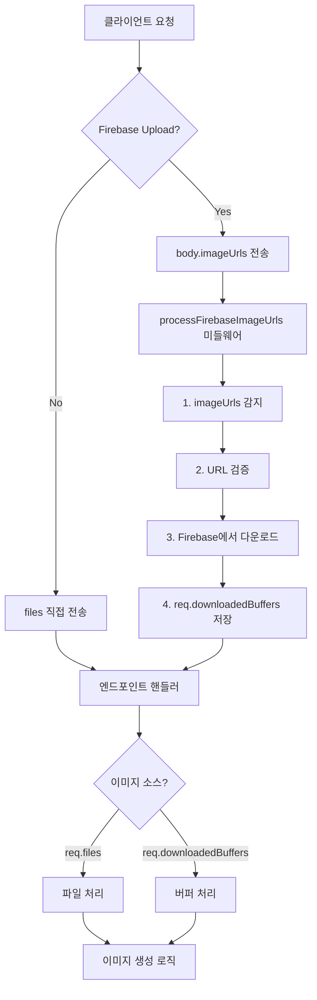

# 🎯 Firebase ImageUrls 중앙화 미들웨어 설계

## 🚨 현재 문제점

### 중복 코드 (DRY 위반)
```typescript
// ❌ 현재: 각 엔드포인트에서 반복
router.post("/generate-image", ..., async (req, res) => {
  const { safeJsonParseArray, validateImageUrls } = await import('../utils/safe-json');
  const imageUrlsRaw = req.body.imageUrls;
  const hasImageUrls = imageUrlsRaw && imageUrlsRaw.trim() !== '';
  let downloadedBuffers: Buffer[] = [];
  
  if (hasImageUrls) {
    const imageUrls = safeJsonParseArray<string>(imageUrlsRaw);
    const validation = validateImageUrls(imageUrls);
    if (!validation.valid) return res.status(400).json({ error: 'URL 검증 실패' });
    
    for (const url of imageUrls) {
      const response = await fetch(url);
      downloadedBuffers.push(Buffer.from(await response.arrayBuffer()));
    }
  }
  // ... 나머지 처리
});

// ❌ /generate-family에서도 동일한 코드 
// ❌ /generate-stickers에서도 동일한 코드
// ❌ 미래의 엔드포인트에서도 반복해야 함
```

### 적용 현황

| 엔드포인트 | imageUrls 지원 | 상태 |
|------------|----------------|------|
| `/generate-image` | ✅ | 수동 추가됨 |
| `/generate-family` | ❌ | 미지원 |
| `/generate-stickers` | ✅ | 방금 추가함 (중복 코드) |
| `/generate-maternity` | ❓ | 확인 필요 |
| `/generate-baby` | ❓ | 확인 필요 |
| `/generate-snapshot` | ❓ | 확인 필요 |
| **미래 엔드포인트** | ❌ | **매번 수동 추가** |

---

## ✅ 제안: 중앙화된 미들웨어

### 설계 원칙
1. **DRY (Don't Repeat Yourself)**: 한 번만 작성
2. **투명성**: 기존 코드 수정 불필요
3. **재사용성**: 모든 엔드포인트에 적용 가능
4. **하위 호환성**: 기존 `req.files` 방식과 공존

### 아키텍처



---

## 📐 구현 계획

### Phase 1: 미들웨어 생성 ✅

**파일**: `server/middleware/firebase-image-download.ts`

```typescript
import type { Request, Response, NextFunction } from 'express';
import { safeJsonParseArray, validateImageUrls } from '../utils/safe-json';

/**
 * Firebase ImageUrls 처리 미들웨어
 * 
 * req.body.imageUrls가 있으면:
 *  1. JSON 파싱 및 검증
 *  2. Firebase Storage에서 이미지 다운로드
 *  3. req.downloadedBuffers에 저장
 * 
 * 기존 req.files와 병행하여 작동
 */
export async function processFirebaseImageUrls(
  req: Request,
  res: Response,
  next: NextFunction
) {
  // imageUrls 감지
  const imageUrlsRaw = req.body?.imageUrls;
  const hasImageUrls = imageUrlsRaw && typeof imageUrlsRaw === 'string' && imageUrlsRaw.trim() !== '';
  
  // imageUrls 없으면 패스 (파일 업로드 모드)
  if (!hasImageUrls) {
    return next();
  }
  
  console.log('🔥 [Firebase 미들웨어] imageUrls 감지');
  
  try {
    // 1. JSON 파싱
    const imageUrls = safeJsonParseArray<string>(imageUrlsRaw);
    
    // 2. URL 검증
    const validation = validateImageUrls(imageUrls);
    if (!validation.valid) {
      return res.status(400).json({
        error: 'Firebase URL 검증 실패',
        details: validation.errors
      });
    }
    
    // 3. 다운로드
    const fetch = (await import('node-fetch')).default;
    const downloadedBuffers: Buffer[] = [];
    
    for (const url of imageUrls) {
      const response = await fetch(url);
      if (!response.ok) {
        throw new Error(`이미지 다운로드 실패: ${url} (${response.status})`);
      }
      downloadedBuffers.push(Buffer.from(await response.arrayBuffer()));
    }
    
    // 4. req에 저장 (TypeScript 확장 필요)
    (req as any).downloadedBuffers = downloadedBuffers;
    (req as any).isFirebaseMode = true;
    
    console.log(`✅ [Firebase 미들웨어] ${downloadedBuffers.length}개 이미지 다운로드 완료`);
    next();
    
  } catch (error) {
    console.error('❌ [Firebase 미들웨어] 오류:', error);
    return res.status(500).json({
      error: 'Firebase 이미지 다운로드 실패',
      details: error instanceof Error ? error.message : String(error)
    });
  }
}
```

### Phase 2: TypeScript 타입 확장

**파일**: `server/types/express.d.ts` (생성)

```typescript
declare namespace Express {
  export interface Request {
    downloadedBuffers?: Buffer[];
    isFirebaseMode?: boolean;
  }
}
```

### Phase 3: 미들웨어 적용

**Before (복잡)**:
```typescript
router.post("/generate-image", requireAuth, uploadFields, async (req, res) => {
  // 40줄의 imageUrls 처리 코드...
  const imageUrlsRaw = req.body.imageUrls;
  const hasImageUrls = ...;
  if (hasImageUrls) {
    // 검증, 다운로드...
  }
  
  // 실제 로직
});
```

**After (간단)**:
```typescript
import { processFirebaseImageUrls } from '../middleware/firebase-image-download';

router.post("/generate-image", 
  requireAuth, 
  uploadFields,
  processFirebaseImageUrls,  // ← 한 줄 추가!
  async (req, res) => {
    // 실제 로직만 작성
    const imageBuffers = req.downloadedBuffers || readFromFiles(req.files);
});
```

### Phase 4: 헬퍼 함수 (선택사항)

**파일**: `server/utils/image-source.ts`

```typescript
/**
 * req에서 이미지 소스를 자동으로 가져오는 헬퍼
 * Firebase 우선, 없으면 파일
 */
export function getImageBuffers(req: Request): Buffer[] {
  // Firebase 모드
  if (req.downloadedBuffers && req.downloadedBuffers.length > 0) {
    return req.downloadedBuffers;
  }
  
  // 파일 모드
  const files = req.files as { [fieldname: string]: Express.Multer.File[] };
  const multipleImages = files?.images || [];
  const singleImage = files?.image?.[0];
  
  if (multipleImages.length > 0) {
    return multipleImages.map(f => f.buffer);
  }
  
  if (singleImage) {
    return [singleImage.buffer];
  }
  
  return [];
}
```

---

## 🔄 마이그레이션 계획

### Step 1: 미들웨어 생성 및 테스트
```bash
# 1. 미들웨어 파일 생성
touch server/middleware/firebase-image-download.ts
touch server/types/express.d.ts

# 2. 코드 작성

# 3. 테스트 엔드포인트에 적용
# /generate-image에 먼저 적용하여 검증
```

### Step 2: 기존 엔드포인트 정리
```typescript
// /generate-image에서 중복 코드 제거
// - imageUrlsRaw 처리 로직 삭제
// - downloadedBuffers 선언 삭제
// - 미들웨어만 추가
```

### Step 3: 나머지 엔드포인트 적용
```typescript
// 순차적으로 적용:
// 1. /generate-family
// 2. /generate-maternity
// 3. /generate-baby
// 4. /generate-snapshot
// 5. /generate-photobook
// 6. /generate-stickers (이미 추가했지만 미들웨어로 교체)
```

### Step 4: 검증
```bash
# 각 엔드포인트에서 테스트:
# - Firebase 업로드 (imageUrls)
# - 서버 업로드 (files)
# - 하이브리드 (둘 다)
```

---

## ✅ 장점

### 1. 코드 간결화
- **Before**: 각 엔드포인트 ~40줄 중복
- **After**: 미들웨어 1줄 추가

### 2. 유지보수성
- 버그 수정 → 미들웨어만 수정
- 기능 추가 → 미들웨어만 확장

### 3. 미래 대응
- 새 엔드포인트 추가 시 미들웨어만 포함
- imageUrls 처리 로직 자동 적용

### 4. 타입 안전성
- TypeScript 타입 확장으로 IDE 지원
- `req.downloadedBuffers` 자동완성

---

## 📋 체크리스트

### 구현
- [ ] `firebase-image-download.ts` 생성
- [ ] `express.d.ts` 타입 확장
- [ ] `image-source.ts` 헬퍼 (선택)
- [ ] 테스트 엔드포인트 적용

### 마이그레이션
- [ ] /generate-image 정리
- [ ] /generate-stickers 정리
- [ ] /generate-family 추가
- [ ] /generate-maternity 추가
- [ ] /generate-baby 추가
- [ ] /generate-snapshot 추가

### 검증
- [ ] Firebase 업로드 테스트
- [ ] 서버 업로드 테스트
- [ ] 에러 처리 테스트

---

## 🎯 예상 효과

### 코드 감소
```
Before: 40줄 × 6 엔드포인트 = 240줄
After: 80줄 미들웨어 + 6줄 (엔드포인트별) = 86줄
절감: 154줄 (64% 감소)
```

### 미래 엔드포인트
```
Before: 매번 40줄 추가
After: 1줄 추가 (미들웨어 포함)
```

---

## 🚀 즉시 실행 가능

**우선순위**: High ⚡

**예상 소요**: 30분
- 미들웨어 생성: 10분
- 기존 엔드포인트 정리: 15분
- 테스트: 5분

**위험도**: Low ✅
- 기존 기능에 영향 없음
- 점진적 적용 가능
- 롤백 용이

---

**작성일**: 2026-01-30 11:30
