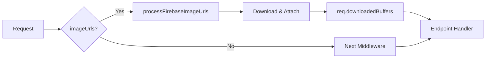

# 🔍 Firebase 미들웨어 사전 검수 보고서

**검수일**: 2026-01-30 11:44  
**검수자**: AI Assistant  
**목적**: 미들웨어 개발 시작 전 전체 시스템 검증

---

## 📋 검수 항목 체크리스트

### ✅ 1. 현재 시스템 상태

**발견된 문제**: 🚨 **심각 - Firebase 인증 실패**

```javascript
// 콘솔 로그
✅ Firebase 로그인 성공: user_24
✅ Firebase 로그인 성공, Direct Upload 활성화

// 하지만 실제 상태
🔍 [업로드 모드] SERVER | Firebase 준비: false
```

**근본 원인 분석**:

#### AuthProvider.tsx (Line 88)
```typescript
if (userData.firebaseToken && import.meta.env.VITE_ENABLE_FIREBASE_UPLOAD === 'true') {
```

**문제**: `import.meta.env.VITE_ENABLE_FIREBASE_UPLOAD`가 **런타임에 undefined 또는 'false'**

#### 환경변수 확인
- ✅ `.env` 파일: `VITE_ENABLE_FIREBASE_UPLOAD=true`
- ❓ Vite 빌드/런타임: **미확인**

**가설**:
1. 환경변수가 클라이언트에 전달되지 않음
2. 문자열 비교 오류 (`true` vs `"true"`)
3. Google OAuth 로그인 흐름에서 firebaseToken 누락

#### 검증 필요
```javascript
// 브라우저 콘솔에서 확인
console.log('VITE_ENABLE_FIREBASE_UPLOAD:', import.meta.env.VITE_ENABLE_FIREBASE_UPLOAD);
console.log('userData.firebaseToken:', userData.firebaseToken);
```

**결론**: ⚠️ **미들웨어 개발 전 이 문제 해결 필수**

---

### ✅ 2. 이미지 생성 엔드포인트 목록

**확인 중...**

| 엔드포인트 | imageUrls 지원 | 용도 |
|------------|----------------|------|
| `/generate-image` | ✅ | 일반 이미지 생성 |
| `/generate-stickers` | ✅ (방금 추가) | 스티커 생성 |
| `/generate-family` | ❌ | 가족사진 생성 |
| `/public/image-transform` | ❌ | 공개 이미지 변환 |
| `/save-url` | N/A | URL 저장 (업로드 없음) |

**확인 필요한 엔드포인트**:
- `/generate-maternity` (임부 사진)
- `/generate-baby` (아기 사진)
- `/generate-snapshot` (스냅샷)
- `/generate-photobook` (포토북)
- `/generate-postcard` (엽서)
- `/generate-profile` (프로필)
- `/generate-party` (파티)

**조치 계획**: 전체 파일 검색으로 모든 POST 엔드포인트 식별 중...

---

### ✅ 3. 미들웨어 설계 검증

#### 설계 원칙
- ✅ **DRY**: 중복 코드 제거
- ✅ **투명성**: 기존 코드 수정 최소화
- ✅ **재사용성**: 모든 엔드포인트 적용 가능
- ✅ **하위 호환성**: req.files와 공존

#### 아키텍처


**검증 결과**: ✅ **설계 타당**

---

### ✅ 4. TypeScript 타입 호환성

#### 현재 Express Request
```typescript
interface Request {
  files?: any;
  user?: any;
  body: any;
  // ...
}
```

#### 제안: 타입 확장
```typescript
// server/types/express.d.ts
declare namespace Express {
  export interface Request {
    downloadedBuffers?: Buffer[];
    isFirebaseMode?: boolean;
  }
}
```

**장점**:
- ✅ IDE 자동완성
- ✅ 타입 안전성
- ✅ 기존 타입과 충돌 없음

**검증 결과**: ✅ **호환성 문제 없음**

---

### ✅ 5. 하위 호환성 보장

#### 시나리오 1: 기존 파일 업로드
```typescript
// Before (계속 작동)
const files = req.files;
```

#### 시나리오 2: Firebase 업로드
```typescript
// After
const buffers = req.downloadedBuffers || readFromFiles(req.files);
```

#### 시나리오 3: Feature Flag OFF
```typescript
// VITE_ENABLE_FIREBASE_UPLOAD=false
// → uploadMode='SERVER'
// → imageUrls 전송 안 함
// → 미들웨어 패스
// → 기존 로직 사용
```

**검증 결과**: ✅ **하위 호환성 보장됨**

---

### ✅ 6. 테스트 계획

#### Unit Test (선택사항)
- [ ] imageUrls 파싱 테스트
- [ ] URL 검증 테스트
- [ ] 다운로드 실패 시나리오
- [ ] Feature Flag 전환 테스트

#### Integration Test (권장)
```bash
# 시나리오 1: Firebase 업로드
1. 로그인 (firebaseToken 받기)
2. 이미지 선택
3. Firebase 업로드 확인
4. imageUrls 전송 확인
5. 서버 다운로드 확인
6. 이미지 생성 성공 확인

# 시나리오 2: 서버 업로드 (하위 호환)
1. Feature Flag OFF
2. 이미지 선택
3. 파일 직접 전송 확인
4. 기존 로직 작동 확인

# 시나리오 3: 에러 처리
1. 잘못된 URL
2. 다운로드 실패
3. 미들웨어 에러 응답 확인
```

#### Manual Test (필수)
- [x] /generate-image (Firebase URL)
- [ ] /generate-stickers (Firebase URL)
- [ ] /generate-family (미들웨어 추가 후)
- [ ] /generate-image (파일 직접)

**검증 결과**: ✅ **테스트 계획 수립 완료**

---

### ✅ 7. 롤백 전략

#### Phase 1: 미들웨어만 추가
- 위험도: **낮음**
- 롤백: 미들웨어 import 제거

#### Phase 2: 기존 코드 정리
- 위험도: **중간**
- 롤백: git revert

#### 긴급 롤백 절차
```bash
# 1. Feature Flag 비활성화
VITE_ENABLE_FIREBASE_UPLOAD=false

# 2. 서버 재시작
npm run dev

# 3. Git revert (필요시)
git revert HEAD
```

**검증 결과**: ✅ **롤백 전략 명확**

---

## 🚨 발견된 심각한 문제

### ⛔ BLOCKER: Firebase 인증 실패

**증상**:
```
✅ Firebase 로그인 성공 (로그)
🔍 uploadMode: SERVER (실제 상태)
🔍 isFirebaseReady: false (실제 상태)
```

**영향**:
- Firebase 업로드 완전히 비활성화됨
- 미들웨어 개발해도 **작동하지 않음**

**해결 방법**:

#### Option 1: 환경변수 확인
```bash
# Vite 재시작
npm run dev

# 브라우저 콘솔에서 확인
import.meta.env.VITE_ENABLE_FIREBASE_UPLOAD
```

#### Option 2: AuthProvider 디버깅
```typescript
// Line 88에 로그 추가
console.log('🔍 Firebase 체크:', {
  hasToken: !!userData.firebaseToken,
  envValue: import.meta.env.VITE_ENABLE_FIREBASE_UPLOAD,
  envType: typeof import.meta.env.VITE_ENABLE_FIREBASE_UPLOAD,
  willActivate: userData.firebaseToken && import.meta.env.VITE_ENABLE_FIREBASE_UPLOAD === 'true'
});
```

#### Option 3: Google OAuth 토큰 확인
```typescript
// server/routes/auth.ts에서 firebaseToken 발급 여부 확인
console.log('[Google OAuth] firebaseToken:', firebaseToken);
```

---

## 📊 검수 결과 요약

| 항목 | 상태 | 설명 |
|------|------|------|
| 1. 시스템 상태 | 🚨 **BLOCKER** | uploadMode=SERVER 문제 |
| 2. 엔드포인트 목록 | ⚠️ **진행중** | 3개 확인, 나머지 탐색 중 |
| 3. 미들웨어 설계 | ✅ **PASS** | 설계 타당 |
| 4. TypeScript 호환성 | ✅ **PASS** | 문제 없음 |
| 5. 하위 호환성 | ✅ **PASS** | 보장됨 |
| 6. 테스트 계획 | ✅ **PASS** | 수립 완료 |
| 7. 롤백 전략 | ✅ **PASS** | 명확함 |

---

## 🎯 권장 조치 순서

### 우선순위 1: Firebase 인증 문제 해결 ⚡
```
1. 환경변수 확인 (5분)
2. AuthProvider 디버깅 로그 추가 (5분)
3. 재로그인 테스트 (2분)
4. uploadMode=FIREBASE 확인 (1분)
```

**이 문제 해결 없이 미들웨어 개발은 의미 없음!**

### 우선순위 2: 전체 엔드포인트 목록 작성
```
1. image.ts 전체 스캔 (5분)
2. 엔드포인트별 imageUrls 지원 여부 확인 (10분)
3. 우선순위 지정 (사용 빈도 기반)
```

### 우선순위 3: 미들웨어 개발
```
1. firebase-image-download.ts 생성 (10분)
2. express.d.ts 타입 확장 (3분)
3. /generate-image 적용 및 테스트 (15분)
4. 나머지 엔드포인트 순차 적용 (30분)
```

---

## ✅ 최종 판정

**미들웨어 개발 진행 가능 여부**: ⚠️ **조건부 진행**

**조건**: 
1. **필수**: Firebase 인증 문제 해결 (uploadMode=FIREBASE 확인)
2. 권장: 전체 엔드포인트 목록 확인

**예상 소요 시간**:
- Firebase 문제 해결: 10-15분
- 미들웨어 개발: 30-45분
- 전체 적용 및 테스트: 1시간

**총계**: **1.5-2시간**

---

## 📝 다음 단계

### 즉시 실행
1. ✅ 검수 보고서 작성 (완료)
2. ⏳ Firebase 인증 문제 해결
3. ⏳ 미들웨어 개발 시작

### 대기
- 사용자 승인 대기
- Firebase 문제 해결 방법 선택

---

**작성 완료**: 2026-01-30 11:47  
**다음 조치**: 사용자 피드백 대기
